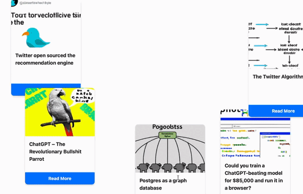

# Hacker News AI Cards

This web application fetches the 5 most popular submissions from Hacker News (Y Combinator) every day and displays them as Magic The Gathering cards. Each card features an AI-generated image based on the submission's title, using the Dall-E API. The cards are draggable and can be stacked, making for an interactive and modern user interface.



## Features

- Fetches 5 most popular submissions from Hacker News daily
- Displays submissions as visually appealing Magic The Gathering cards
- AI-generated images based on submission titles using Dall-E API
- Draggable cards for an interactive user experience
- Responsive design with Bootstrap
- Asynchronous card loading with progress circle

## Installation and Setup

1. Clone the repository:
    ```
    git clone https://github.com/bahrep/hn-cards.git
    cd hn-cards
    ```

2. Install required packages:
    ```
    pip install asyncio aiohttp openai flask 
    ```

3. Set up the OpenAI API key environment variable:
    ```
    export OPENAI_API_KEY="your_openai_api_key"
    ```

4. Run the application:
    ```
    python app.py
    ```

5. Open your browser and navigate to `http://localhost:5000`.

## License

There is no license. I wrote 0 lines of code or text myself. It is all generated by GPT-4, and all I did was putting all code into one project (and writing this note).
